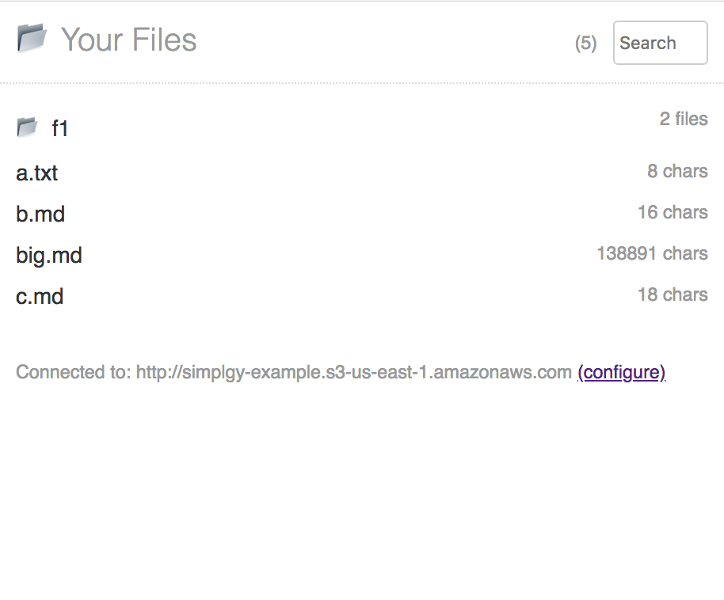
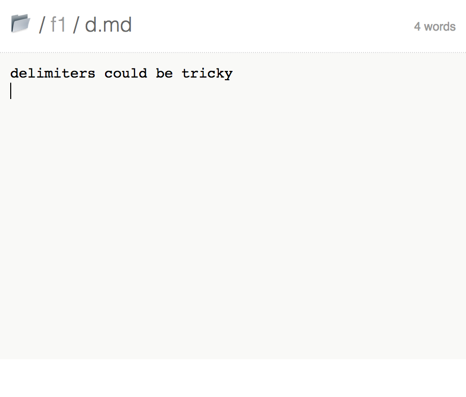

# s3 Text UI

This is a simple text file viewer meant for use with AWS s3.

If you want view-only access to your text files in an encrypted s3 bucket, this app might be for you.

## Features

* Navigate heirarchies of folders
* View text and markdown files
* Mobile and desktop web
* Credentials stored on device only (for security and simplicity)
* Support for up to 1000 files. (accepting donations or PRs)

## Screenshots

Here it is showing a list of text files:



And here is viewing a single text file:




## Set Up

1. Create an AWS S3 bucket to use as a source of text files. For it to work with this application, you'll have to [configure permissions](http://docs.aws.amazon.com/sdk-for-javascript/v2/developer-guide/getting-started-browser.html#getting-started-browser-iam-role) and [enable CORS](http://docs.aws.amazon.com/sdk-for-javascript/v2/developer-guide/getting-started-browser.html#getting-started-browser-create-bucket). If you've never used S3 this project might be a bit difficult to set up, but I believe you can do it.
2. Configure the application to point to an s3 bucket that hosts your text files. to do this, create a file `src/.s3cfg.js`. You can use `src/.s3cfg-EXAMPLE.js` as a starting point.

Example CORS configuration:

```xml
<?xml version="1.0" encoding="UTF-8"?>
<CORSConfiguration xmlns="http://s3.amazonaws.com/doc/2006-03-01/">
<CORSRule>
    <AllowedOrigin>*</AllowedOrigin>
    <AllowedMethod>GET</AllowedMethod>
    <AllowedMethod>PUT</AllowedMethod>
    <AllowedMethod>POST</AllowedMethod>
    <AllowedMethod>DELETE</AllowedMethod>
    <MaxAgeSeconds>3000</MaxAgeSeconds>
    <ExposeHeader>x-amz-server-side-encryption</ExposeHeader>
    <ExposeHeader>x-amz-request-id</ExposeHeader>
    <AllowedHeader>*</AllowedHeader>
</CORSRule>
</CORSConfiguration>
```

Example S3 permissions configuration (substitute `YOUR_BUCKET_HERE`):

```json
{
    "Version": "2012-10-17",
    "Statement": [
        {
            "Sid": "VisualEditor0",
            "Effect": "Allow",
            "Action": [
                "s3:GetBucketTagging",
                "s3:GetBucketCORS",
                "s3:ListBucket",
                "s3:GetBucketAcl",
                "s3:GetBucketPolicy"
            ],
            "Resource": "arn:aws:s3:::YOUR_BUCKET_HERE"
        },
        {
            "Sid": "VisualEditor1",
            "Effect": "Allow",
            "Action": [
                "s3:GetObjectVersionTagging",
                "s3:PutObjectVersionTagging",
                "s3:PutObject",
                "s3:GetObjectAcl",
                "s3:GetObject",
                "s3:GetObjectVersionAcl",
                "s3:GetObjectTagging",
                "s3:PutObjectTagging",
                "s3:GetObjectVersionForReplication",
                "s3:DeleteObject",
                "s3:GetObjectVersion"
            ],
            "Resource": "arn:aws:s3:::YOUR_BUCKET_HERE/*"
        }
    ]
}
```

## Start Developing

Get dependencies:

    npm install

Run the development environment:

    npm start

Run unit tests:

    npm test

SASS isn't complied automaticaly. When working on styles, run the watcher:

    npm run sass
    
Or run it as a one-time compilation:

    npm run sass-once

If you add a brand-new sass file, make sure you `import` it somewhere (eg: index.js' `import './index.css';`)

## Deploying

This repo uses GitHub pages to deploy for convenience.
The "deployment" consists of building the project, copying it to the `docs/` folder (Github convention), and pushing to remote.

    npm run deploy
    # This builds the deployment. Then, git commit/push to publish it.

## Todo list

- [x] Add some simple markdown syntax highlighting (that doesn't change char positions) -- tried codemirror via react-md-editor and ace and didn't like either
- [x] First let's grab the url in componentDidMount -> window.location.pathname
- [x] Then we'll turn it in to a meaningful action with urlToAction
- [x] Include Redux
- [x] send redux the url changed action
- [x] turn the action into a useful state
- [x] handle a filename that isn't found
- [x] observe the back/forward buttons and react appropriately
- [x] support reading data from an s3 bucket
- [x] get file details from s3 bucket
- [x] turn `size` into a char count (assuming plain text), and count words
- [x] Show the bucket name you're connected to
- [x] Make the text appear editable and scroll nicely
- [x] If props.file.content != editableText, show a save button. Enable cmd+s for the button
- [x] Have the save button actually persist to the server
- [x] override cmd+s to save on chrome (got ctrl+s to work, but having trouble blocking browser behavior with cmd) -- use `keydown` instead of `keypress`
- [x] Quickly build a functional way to sync a system folder with the s3 bucket (command line npm module?)
- [x] CORS must be enabled on the bucket/resource. Have a clear warning on the front end when we detect that this is the problem
- [x] Add a client-side search filter
- [x] Support tests
- [x] Support navigable folders
- [x] Adjust layout for mobile
- [x] Reuse header for individual file and file list
- [x] Document deployment steps
- [x] Add a configuration screen so you can set your aws keys through the ui. they are persisted safely to your local device.
- [ ] Detect missing configuration
- [ ] Have clear errors in the UI for timed out or failed aws calls
- [ ] Have clear error messaging for incorrect configuration
- [ ] Add a caching layer to the `files` api so you can call `get` as often as you want.
- [ ] grow search area when focused on mobile without shifting title text
- [ ] Infinite scroll for long file lists

## Nice to Have

- [ ] Live refresh the text, mixing in the current user's edits intelligently (2-way-sync challenge)
- [ ] cache file list and file contents on device; if old, greedy-invalidate. if not fresh, lazy-invalidate
- [ ] gui configurable s3 bucket target & key


---

This project was bootstrapped with [Create React App](https://github.com/facebookincubator/create-react-app).
